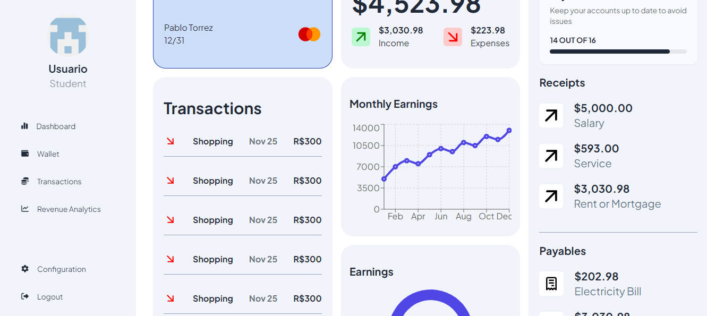

# Gestor de Finanzas con Autenticación de Usuarios JWT en Node y React
La aplicación implementa autenticación basada en Json Web Token (JWT) el cual redirije al usuario a un Dashboard para administrar gastos. Los usuarios pueden registrarse e iniciar sesión, y las rutas protegidas son solo accesibles con un token válido.

## Características
- Stack Front: React JS, TailwindCSS/DaisyUI.
- Stack Backend: Node JS, Express.
- Stack DB: Postgres con Docker.
- Axios para comunicarme con el Backend.
- Contraseñas protegidas con Bcrypt.
- Autenticación de usuarios con JWT.
- Arquitectura y planificación con Draw.io.
- Desarrollo de la UI con [Tailwind CSS](https://tailwindui.com/) y [DaisyUI](https://daisyui.com/) para acelerar el desarrollo y reutilizar componentes.
- Funcionamiento dinámico de client/server con APIs.
- Manejo de formularios y validaciones.
- Actualización dinámica de la UI cuando se agregar, editan o eliminan gastos.
- Pruebas y Debugging.
- Diseño de la Aplicación con FIGMA: Creamos el diseño de la interfaz de usuario (pueden surgir cambios):

<!-- Más (sacar de Figma) -->

## Requisitos Previos
Antes de comenzar, asegurate de tener instalado:
- Node.js (incluye npm)
- PostgreSQL
- Docker y Docker Compose
- Git
- Visual Studio Code o cualquier editor de código que uses

## Instalación en tu computadora
1. Clonar el repositorio
```bash
git clone https://github.com/pblnahu1/gestor-de-finanzas-project
cd gestor-de-finanzas-project
```
2. Backend. Instalar las dependencias
```bash
cd backend 
npm install
```
3. Client. Instalar las dependencias
```bash
cd client
npm install
```
4. Creación de la base de datos de postgres con docker (abajo está explicado en detalle)

## Comandos importantes
### Backend
- Crear la BD Postgres con Docker (podés usar Docker Desktop para visualizar mejor si el contenedor está activo o no):
```bash
# Crear el contenedor Postgres:
# docker run --name <nombre_contenedor> -e POSTGRES_PASSWORD=<tu_contraseña> -d -p <puerto_disponible_postgres>:5432 postgres
docker run --name render-postgres -e POSTGRES_PASSWORD=mysecretpassword -d -p 5444:5432 postgres

# Para conectarme desde el backend a postgres hay que instalar:
npm i pg

# Para verificar si el contenedor esta corriendo:
docker ps

# Para ver los logs del contenedor
docker logs render-postgres

# Para correr el contenedor:
docker start render-postgres

# Para ver contenedores en ejecucion
docker-compose up -d

# Conectarme a PostgreSQL desde el contenedor y poder hacer consultas desde la terminal
# docker exec -it <nombre_del_contenedor> psql -U <usuario> -d <nombre_base_datos>
docker exec -it render-postgres psql -U postgres -d postgres

# Aparece
postgres=# 
# Y ahi podemos crear tablas
postgres=#CREATE TABLE users (
postgres=#id SERIAL PRIMARY KEY,
postgres=#email VARCHAR(255) NOT NULL,
postgres=#password VARCHAR(255) NOT NULL
postgres=#);
postgres=#
postgres=#INSERT INTO usuarios (email, contraseña) 
postgres=#VALUES ('usuario@example.com', 'contraseña123');

# Para ver las tablas:
\dt

# Para salir de PSQL
\q

# Para salir del contenedor con el comando
exit

# Detener el contenedor (si es necesario)
docker stop render-postgres

# Si existiese un archivo docker-compose.yml
docker-compose up -d

# Para detener el contenedor con docker-compose
docker-compose down
```

- Iniciar el servidor desde /backend
```bash
npm run dev
# Correrá el servidor en localhost:3001
```

- Dependencias instaladas en el Backend
| Dependencia | Comando de Instalación | Descripción |
|----------|----------|----------|
| `express` | `npm install express` | Framework minimalista para crear servidores y gestionar rutas HTTP en Node.js. |
| `bcrypt` | `npm install bcrypt` | Biblioteca para encriptar contraseñas y validarlas de manera segura. |
| `body-parser` | `npm install body-parser` | Middleware para analizar datos del cuerpo de las solicitudes HTTP. |
| `cookie-parser` | `npm install cookie-parser` | Middleware para manejar cookies en las solicitudes HTTP. |
| `cors` | `npm install cors`  | Habilita solicitudes entre diferentes dominios (Cross-Origin Resource Sharing). |
| `dotenv` |`npm install dotenv` | Carga variables de entorno desde un archivo `.env` al entorno de ejecución. |
| `fs` |`npm install fs` | Biblioteca para trabajar con el sistema de archivos en Node.js. |
| `jsonwebtoken` |`npm install jsonwebtoken` | Genera y verifica JSON Web Tokens (JWT) para autenticación. |
| `multer` |`npm install multer` | Middleware para manejar la subida de archivos en solicitudes HTTP. |
| `nodemon` |`npm install nodemon` | Herramienta para reiniciar automáticamente el servidor al detectar cambios en el código. |
| `path` |`npm install path` | Biblioteca para trabajar con rutas de archivos y directorios. |
| `pg` |`npm install pg` | Librería para interactuar con bases de datos PostgreSQL desde Node.js. |

### Frontend (Client)
- Iniciar aplicación React
```bash
npm run dev
# Levanta la App en localhost:5173
```
- Dependencias instaladas en el Frontend:
1. Tener instalado Node JS: https://nodejs.org/es/
2. Para instalar Tailwind CSS:
```bash
npm install -D tailwindcss postcss autoprefixer
npx tailwindcss init -p
```
- Esto crea los archivos `tailwind.config.js` y `postcss.config.js`
- En `tailwind.config.js` agregar en 'content' esto:
```js
content: [
  "./index.html",
  "./src/**/*.{js,ts,jsx,tsx}",
],
```
3. Instalar daisyUI como un paquete npm:
```npm i -D daisyui@latest```
- Agregar daisyUI a tailwind.config.js:
```js
import daisyui from "daisyui"
module.exports = {
  //...
  plugins: [
    daisyui,
  ],
}
```
4. Tener instalado React Router
```bash
npm install react-router-dom
```
5. Paquete recharts
```bash 
npm install recharts
```
6. Axios
```bash
npm install axios
```